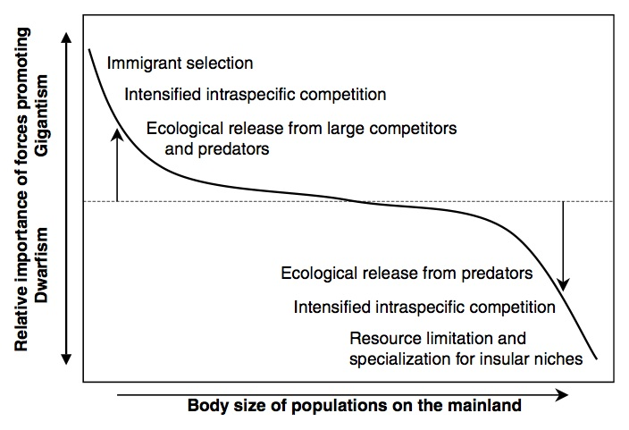

## Theoretical Ecology
=====================
## 2014 Spring  
## Tim Szewczyk  
### Island Body Size Changes  

This project aims to develop a mathematical representation of the processes that lead to the common changes that occur when a species colonizes an island. Specifically, there is a tendency for small animals to become larger (island gigantism) and for large animals to become smaller (island dwarfism). These changes have been documented in several taxa, though they appear to be strongest in mammals.  
  
Several processes have been proposed to underlie this phenomenon, including a release from predators and interspecific competition, and an increase in intraspecific competition (Fig. 1). Additionally, there is likely selection for specific body types during colonization and resource limitation once colonized. These drivers (intraspecific competition and release from predators and competitors) are hypothesized to drive body sizes towards an optimal range of middle sizes.  
  
  
This model will be:
- Discrete space  
- Discrete time  
- Individual based  
- Stochastic  
  - Deaths  
  - Births  
  - Mutations  

Process blocks:  
- Intra-island movement with predation  
- Intraspecific competition  
- Births  
- Resource regeneration  

Key objects:  
- *E*: island environmental matrix  
- *w*: individual resource requirement  
- *L*: 